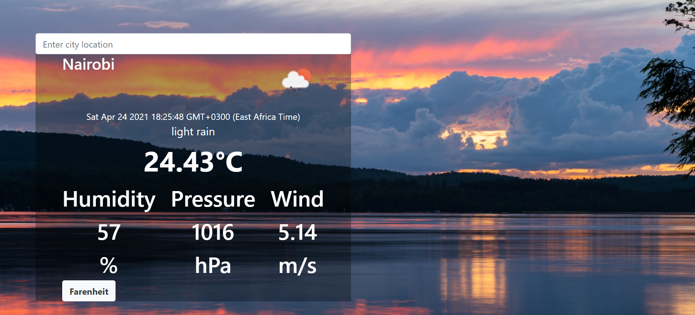

# Weather App
The weather app project is built using the  open weather API from the [OpenWeatherApp](https://openweathermap.org/current#data).
One can extract weather information about a current weather from a city which includes parameters like:
- Temperature(Which can be toggled from Celsius to Farehnheit)
- Humidty
- Preseure
- WindSpeed

## Screenshot

## Built With

- JavaScript
- CSS
- Bootstrap

## Getting Started

- Clone the repo `https://github.com/ZawadiSumba66/weather-app.git`
- cd into `weather-app`
- Run `git pull origin weather`
- On the terminal run:
  - `` npm install`` to get a copy of the packages in your local environment
  - ``npm run build`` to run webpack that will intergrate all changes made
- Open the app in your local host server while on the `weather-app` directory

## Author

👤 **Rose Sumba**

- GitHub: [@ZawadiSumba66](https://github.com/ZawadiSumba66)
- Twitter: [@zawadirose1](https://twitter.com/zawadirose1)
- LinkedIn: [rose-sumba](https://www.linkedin.com/in/rose-sumba-9b36401b5/)

## 🤝 Contributing

Contributions, issues and feature requests are welcome!

Feel free to check the [issues page](issues/).

## Show your support

Give a ⭐️ if you like this project!

## 📝 License

Copyright 2021 Rose

Permission is hereby granted, free of charge, to any person obtaining a copy of this software and associated documentation files (the "Software"), to deal in the Software without restriction, including without limitation the rights to use, copy, modify, merge, publish, distribute, sublicense, and/or sell copies of the Software, and to permit persons to whom the Software is furnished to do so, subject to the following conditions:

The above copyright notice and this permission notice shall be included in all copies or substantial portions of the Software.

THE SOFTWARE IS PROVIDED "AS IS", WITHOUT WARRANTY OF ANY KIND, EXPRESS OR IMPLIED, INCLUDING BUT NOT LIMITED TO THE WARRANTIES OF MERCHANTABILITY, FITNESS FOR A PARTICULAR PURPOSE AND NONINFRINGEMENT. IN NO EVENT SHALL THE AUTHORS OR COPYRIGHT HOLDERS BE LIABLE FOR ANY CLAIM, DAMAGES OR OTHER LIABILITY, WHETHER IN AN ACTION OF CONTRACT, TORT OR OTHERWISE, ARISING FROM, OUT OF OR IN CONNECTION WITH THE SOFTWARE OR THE USE OR OTHER DEALINGS IN THE SOFTWARE.
